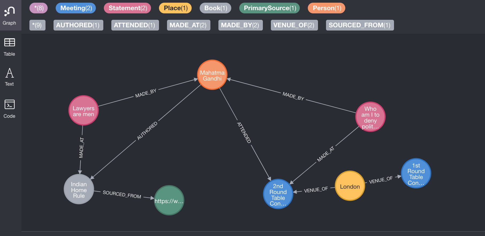

# NeoHistoricity

## TLDR
An app for researchers of history and normal people to determine historicity.

## Running The App

1. Setup Neo4j database
2. Configure secrets
3. Run `npm install` and `npm start`

## Description

We made an app based on Neo4j which can provably determine historicity of claims about persons and events based on a graph representation of events, people, places and sources. We can query, based on exhaustive collections of data about people, for relations between the nodes and determine objectively, the answers to questions which political researchers and historians seek. For instance, our app(when fed with enough data) will be able to create nodes for all primary data about Gandhi and can answer some abstract question(based on queries) like 'Was Gandhi racist?' with some certainty and with a list of events/quotes from Gandhi which lead to the conclusion. Other concrete relationship based queries(say, about queries like 'how many prayer meetings did Gandhi hold in Lahore?') are obviously supported by graphdbs.

Similar relationship queries can also be used in related use cases like legal investigations, which may be even automated based on rule engines to find violations in compliance. The common theme in these use cases is that the investigators/researchers, by the very nature of their job, study the events/people/sources in a structured manner. They also do not want to arrive at conclusions based on the idea of 'relevance' which is offered by text based search. For instance, for a researcher studying Gandhi's quotes, he/she would want to avoid the noise of all events where Gandhi's name came up in conversations between third persons. A traditional Google search or any search based research into these topics will add the noise and will not improve the researcher's understanding based on the traditional linear study they do. And it helps in a legal investigation/proceeding if people's punishment/penalty is not based on probability.

## Background

Graph databases allow researchers to preserve the structure they extract from studying sources and later use it to reference and cross-check sources. This structure based on relationships may be the ideal way to store history for posterity. It is easy to that this is definitely better than file/blob based history which we have today. After all, most(if not all) history is a placing of what, when, who, where and as per whom with many times the query 'why' as an analysis. There is a structure in there which is lost along with the context, very easily. Using relationships at scale can help researchers save on their memory and organize this data in a manageable way. In a sense, this is ETL built for researchers/investogators.

A recent trend in study of history is revisionism based on new facts and construction of modern history from first principles and primary sources. While the intent of these new methods is to filter out bias in earlier sources of history, the techniques employed are only as good and exhaustive as the meticulosity of the researcher and may suffer from same bias characteristics of history-telling the researchers seek to avoid. Writing history or more accurately put, organizing primary sources as graphs is the way to go, to put history on a firmer basis and bring the field some sanctity comparable to pure sciences.

This graph approach is also what traditional citation/footnote mechanism seeks to achieve in research but is limited by the liberty an author can take to narrate a different story than what their references say(even if in an obvious way). For instance, it should not have taken years to discredit 'historical' writings like [The Protocols of the Elders of Zion](https://en.wikipedia.org/wiki/The_Protocols_of_the_Elders_of_Zion) and [From Time Immemorial](https://en.wikipedia.org/wiki/From_Time_Immemorial).

In the age of disinformation and Google Search based linked/cited news generated very hour, serious research needs comparable speed to cull fake news fast. Because 'a lie travels around the globe while the truth is putting on its shoes'. Incidentally, another example of applying this approach is finding out whether the preceding quote was actually due to Mark Twain as alleged. We now have politicians tweeting out some BS to millions of readers and the fact-checking snopes article that comes out a week later would be read by, may be, 10,000 people.

## Prior Art

We discovered that a similar attempt has been made under a project called [Codex](https://neo4j.com/blog/building-graph-history-codex/#who-codex). After all, the thought that there are relationships in history is not exactly groundbreaking. But the idea there is to build structure out of text automatically using NLP. Our belief is that this can give results only as good as textual search engines, because the source for nodes in the graph is only as good as NLP based analysis. It does not have the exhaustive and verifiable nature of a researcher manually adding data on primary sources to a graph of history.

Without discipline in the process of writing down history, we are bound to write structured knowledge about events down as unstructured text and then try to read it back(by some reader of a book, say) as structured knowledge into mind and then put it down back as unstructured text(in another monograph, say) and so on. There is loss of information involved at each generation(due to interpretation, hindsight bias etc), unlike say, a mathematical theorem which can be reproduced after many generations without losing integrity.

## Further Steps

1. Migrations - When the schema of our db is not satisfactory, we should have transitions which allow for our graph to add details, change schema and do similar transitions which are akin to migrations of traditional relational databases.
2. Attribution - A wikipedia like attribution/history trace is helpful to unwind and rewind changes.
3. Ordinality - There are some cases where we will need order of events which cannot be captured by graph databases.
4. Semantic search - Traditional text based search and other techniques are still valuable when applied on top of graphs.
